# Architecture Map

Nethereum ships 130+ NuGet packages. You don't need all of them — most apps start with `Nethereum.Web3` and add extension packages as needed. This page shows how everything fits together.

## Package Layers

The core packages form three layers. Higher layers depend on lower ones.

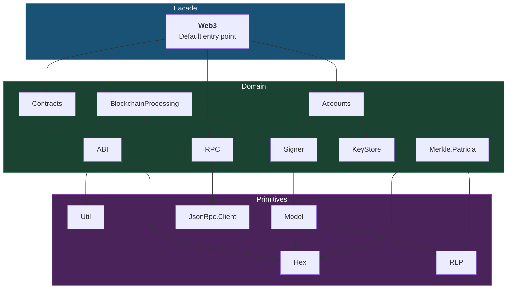

## Section Diagrams

Each diagram below corresponds to a sidebar section and shows the actual NuGet packages and their dependency relationships.

---

### Core Foundation

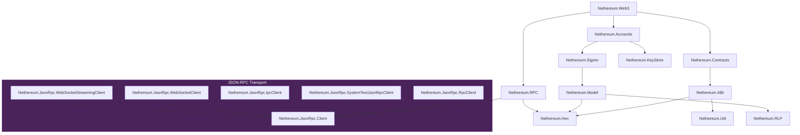

Also in this section: `Nethereum.Util.Rest`, `Nethereum.BigInteger.N351`, `Nethereum.RPC.Extensions`, `Nethereum.RPC.Reactive`, `Nethereum.Merkle`.

---

### Signing & Key Management

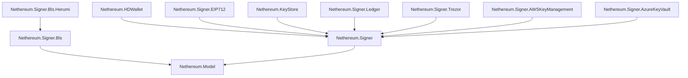

---

### Smart Contracts

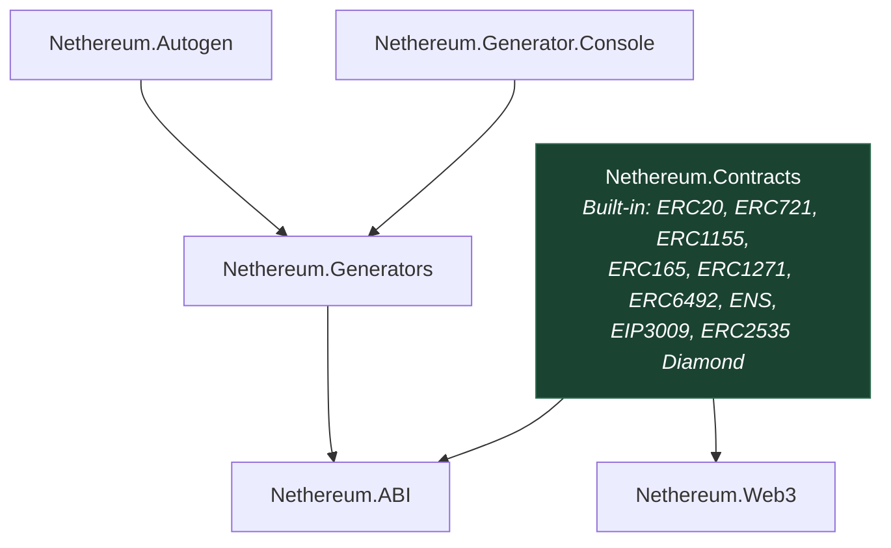

---

### DeFi & Protocols

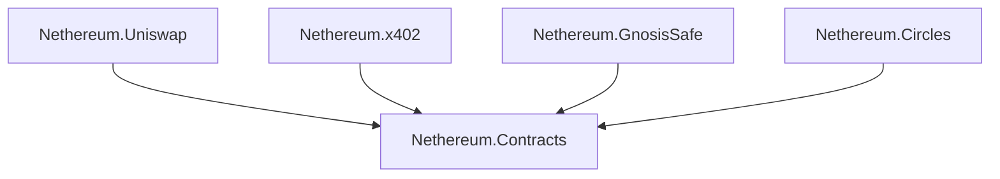

---

### EVM Simulator

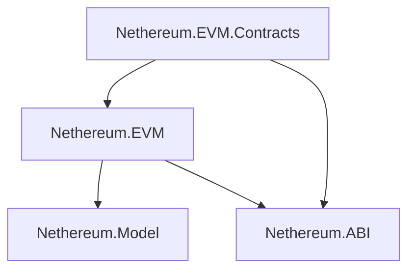

---

### Chain Infrastructure

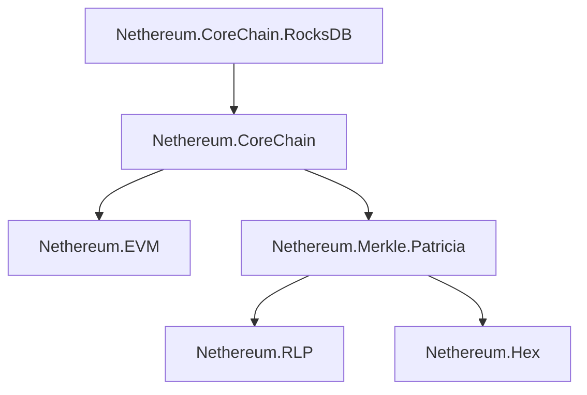

---

### DevChain

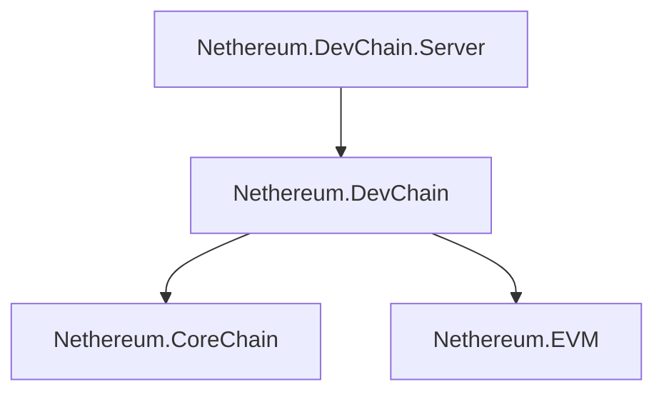

---

### AppChains (Preview)

**Core packages:**

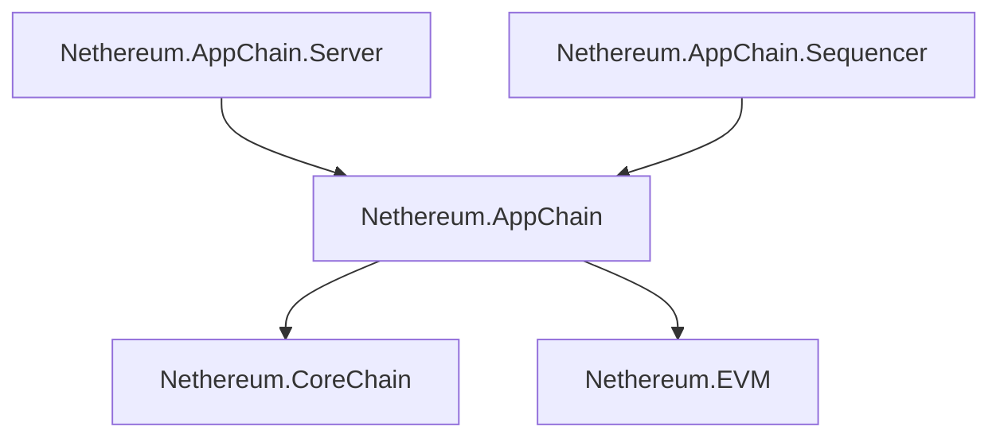

**Networking, governance & anchoring:**

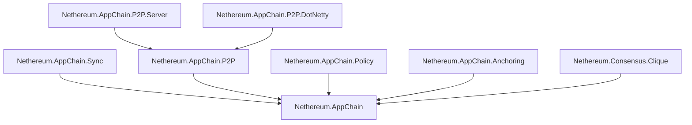

---

### Account Abstraction

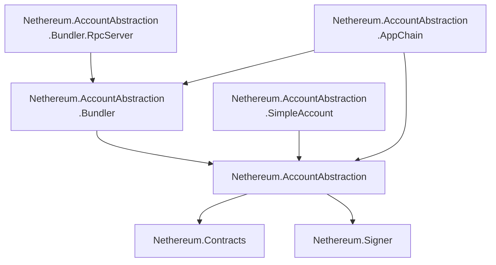

---

### Data, Indexing & Explorer

**Processing pipeline:**

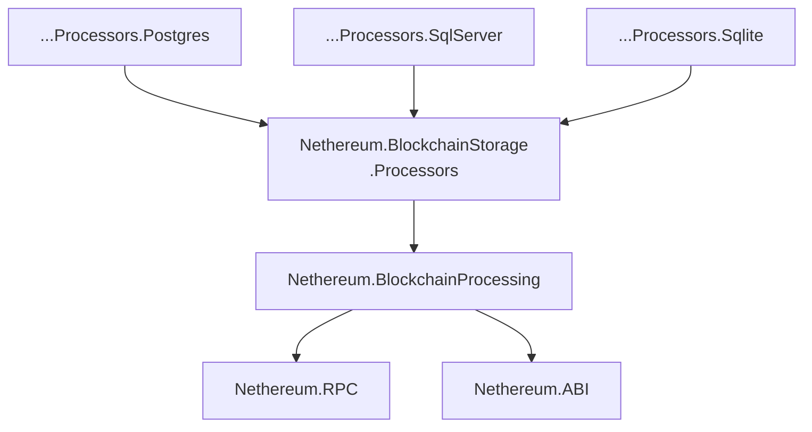

**Storage providers, explorer & token services:**

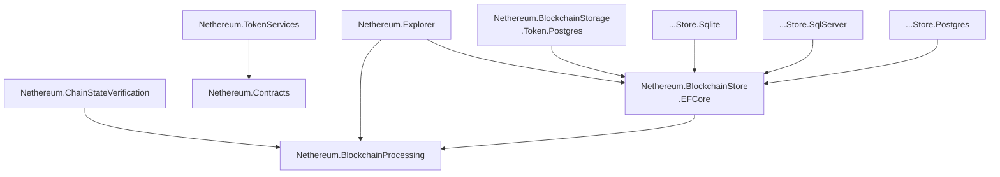

---

### MUD Framework

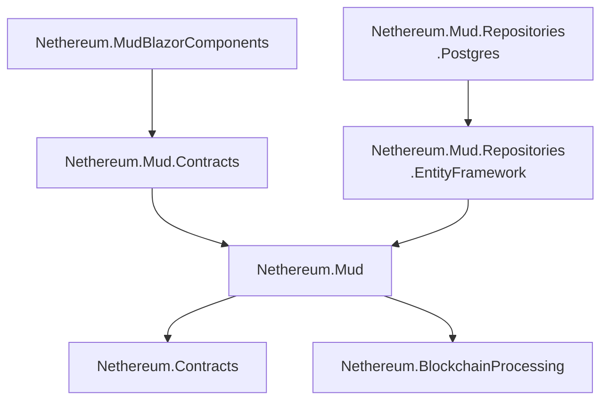

---

### Wallet & UI

**Wallet core packages:**

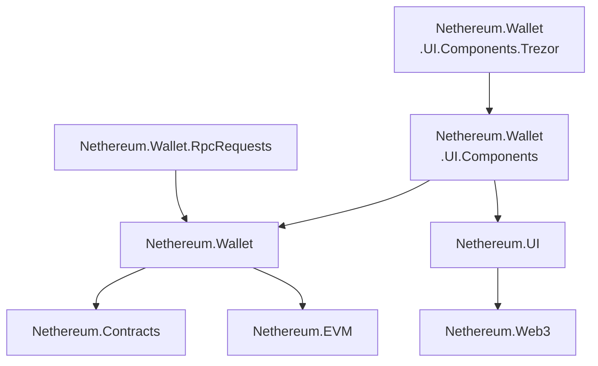

**Blazor stack & browser connectors:**

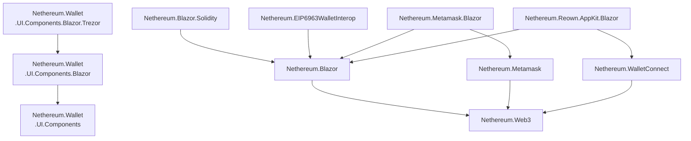

**MAUI:**

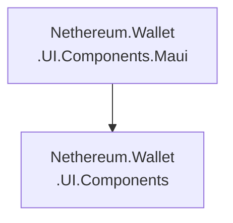

---

### Unity

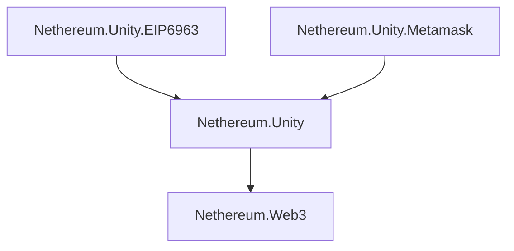

---

### Data Services

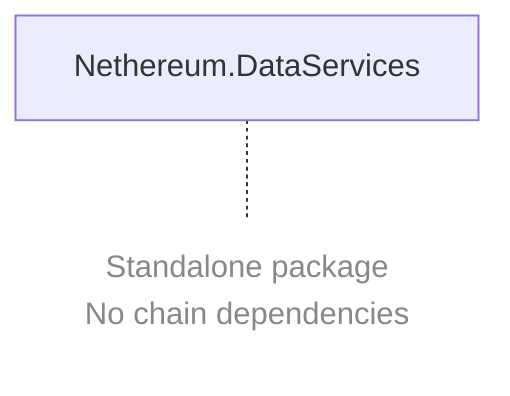

---

### Consensus Light Client

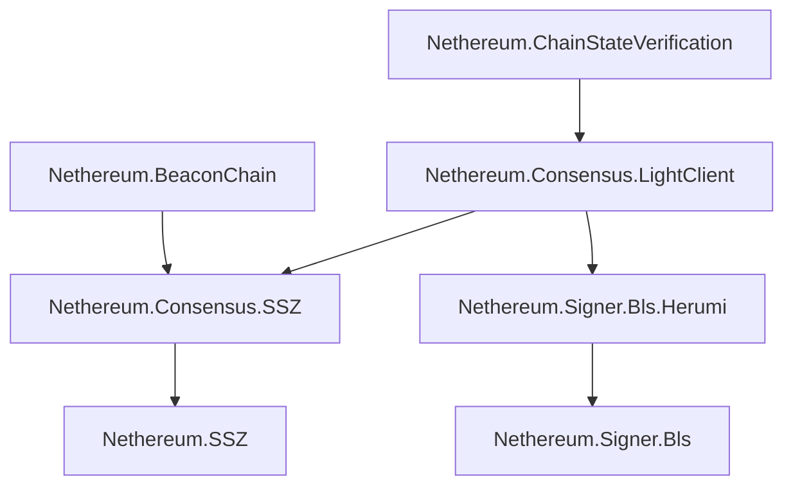

---

### Client Extensions

```mermaid
graph TD
    Geth["Nethereum.Geth"] --> RPC["Nethereum.RPC"]
    Besu["Nethereum.Besu"] --> RPC
    Quorum["Nethereum.Quorum"] --> RPC
```

---

## Common Stacks

Real-world package combinations for typical projects.

| Use case | Packages |
|---|---|
| **Basic dApp** | `Nethereum.Web3` |
| **Local Dev** | `Nethereum.DevChain` + `Nethereum.DevChain.Server` + `Nethereum.Explorer` |
| **Production AppChain** | `Nethereum.AppChain.Server` + `Nethereum.AppChain.Sequencer` + `Nethereum.AppChain.P2P.Server` + `Nethereum.AppChain.Anchoring` |
| **Blockchain Indexer** | `Nethereum.BlockchainProcessing` + `Nethereum.BlockchainStore.Postgres` + `Nethereum.TokenServices` |
| **MUD World** | `Nethereum.Mud` + `Nethereum.Mud.Contracts` + `Nethereum.Mud.Repositories.Postgres` |
| **Blazor Wallet** | `Nethereum.Wallet.UI.Components.Blazor` + `Nethereum.EIP6963WalletInterop` + `Nethereum.Reown.AppKit.Blazor` |
| **Unity Game** | `Nethereum.Unity` + `Nethereum.Unity.EIP6963` |

For help choosing packages, see [What Do You Want to Do?](what-do-you-want-to-do.md).
