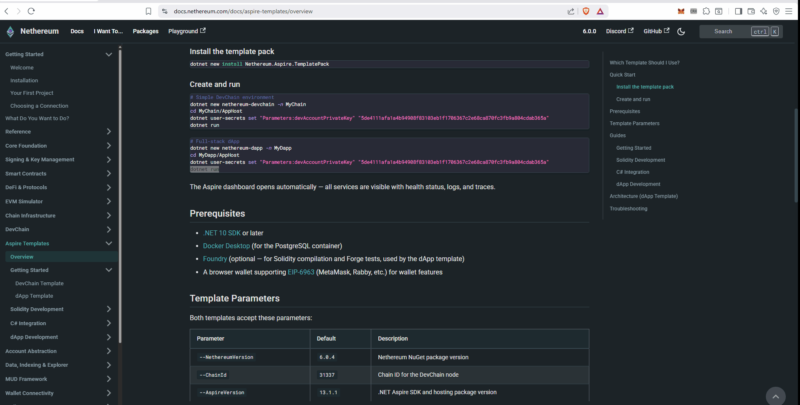

# dApp Template

The `nethereum-dapp` template gives you a complete, full-stack Ethereum dApp — Solidity contracts, C# code generation, a Blazor web UI with wallet integration, an embedded testing strategy, and the full DevChain + Indexer + Explorer infrastructure. Everything is wired together with .NET Aspire and ready to run.

If the [DevChain template](guide-devchain-template) gives you the infrastructure, this template gives you the **application** on top of it.

## What You'll Build

The template creates a solution with 9 projects spanning the entire development stack:

| Project | Role |
|---------|------|
| **AppHost** | Aspire orchestrator — wires all services together |
| **DevChain** | Local Ethereum node (JSON-RPC, EIP-1559, debug tracing) |
| **Indexer** | Background worker indexing blocks, transactions, tokens into PostgreSQL |
| **Explorer** | Blazor blockchain explorer with contract interaction and ABI decoding |
| **WebApp** | Blazor dApp UI with EIP-6963 wallet connection and token interaction |
| **LoadGenerator** | Background worker generating test transactions (mint, transfer, ETH send) |
| **ContractServices** | Pre-generated C# typed contract access from Solidity ABI |
| **Tests** | Fast TDD tests with embedded DevChain (no Docker needed) |
| **IntegrationTests** | E2E tests against the running AppHost |

Plus a `contracts/` directory with a complete Foundry project.

## Prerequisites

- [.NET 10 SDK](https://dotnet.microsoft.com/download) or later
- [Docker Desktop](https://www.docker.com/products/docker-desktop/) (for PostgreSQL)
- [Foundry](https://getfoundry.sh/) (optional — for Solidity compilation and Forge tests)
- A browser wallet supporting [EIP-6963](https://eips.ethereum.org/EIPS/eip-6963) (MetaMask, Rabby, etc.)

## Step 1: Create the Project

```bash
dotnet new nethereum-dapp -n MyDapp
cd MyDapp
```

## Step 2: Set the Dev Account Private Key

```bash
cd AppHost
dotnet user-secrets set "Parameters:devAccountPrivateKey" "5de4111afa1a4b94908f83103eb1f1706367c2e68ca870fc3fb9a804cdab365a"
cd ..
```

## Step 3: Run the TDD Tests

Before starting any services, verify everything works with the fast unit tests:

```bash
dotnet test Tests/
```

These tests use an **embedded DevChain** — no Docker, no Aspire, no HTTP. They deploy contracts, call functions, and verify results in seconds. The template ships with 7 passing tests covering deploy, mint, transfer, approve, and transferFrom.

## Step 4: Run the Full Stack

```bash
dotnet run --project AppHost
```

The Aspire dashboard opens at `https://localhost:17178`. All 6 services start up — DevChain, Indexer, Explorer, WebApp, LoadGenerator, and PostgreSQL.



## Step 5: Use the WebApp

Open the **WebApp** URL from the Aspire dashboard. The Token Interaction page walks you through the full ERC-20 lifecycle:

1. **Connect your wallet** — click "Connect Wallet" in the header (MetaMask or any EIP-6963 wallet)
2. **Switch to the DevChain** — if you're on the wrong chain, click "Switch to DevChain" (MetaMask will prompt to add the network)
3. **Deploy a token** — set name, symbol, initial supply, and click Deploy
4. **Mint tokens** — send new tokens to any address
5. **Transfer tokens** — move tokens between addresses
6. **Check balances** — query any address's token balance

## Step 6: Explore in the Explorer

Open the **Explorer** URL from the dashboard. You'll see:

- All transactions from the LoadGenerator and your WebApp interactions
- Click any contract address — if it was deployed from the template's Solidity contracts, the Explorer auto-discovers the ABI from the Foundry build output and shows decoded function calls and a contract interaction UI

## Step 7: Run Integration Tests

With the AppHost still running:

```bash
dotnet test IntegrationTests/
```

These E2E tests connect to the live DevChain, deploy contracts, and verify the full pipeline works including indexer processing.

## Project Structure

```
MyDapp/
├── AppHost/            Aspire orchestrator
├── DevChain/           Ethereum node
├── Indexer/            Block indexer → PostgreSQL
├── Explorer/           Blockchain explorer
├── WebApp/             dApp UI with wallet integration
├── LoadGenerator/      Test transaction generator
├── ContractServices/   Generated C# typed contracts
├── Tests/              TDD tests (embedded DevChain)
├── IntegrationTests/   E2E tests (live AppHost)
├── ServiceDefaults/    Shared Aspire config
├── contracts/          Foundry project
│   ├── src/            Solidity source (MyToken.sol)
│   ├── test/           Forge tests (MyToken.t.sol)
│   ├── script/         Deploy scripts (Deploy.s.sol)
│   └── out/            Compiled artifacts (ABI, bytecode)
└── scripts/            C# code generation scripts
```

## The Development Loop

The template supports a fast inner loop:

1. **Edit Solidity** in `contracts/src/`
2. **Compile** with `cd contracts && forge build`
3. **Test in Solidity** with `forge test`
4. **Regenerate C#** with `pwsh scripts/generate-csharp.ps1` (or `bash scripts/generate-csharp.sh`)
5. **Test in C#** with `dotnet test Tests/` (fast, no Docker)
6. **Run the full stack** with `dotnet run --project AppHost`
7. **Test E2E** with `dotnet test IntegrationTests/`

The template ships with pre-generated C# so you can skip steps 1-4 and go straight to `dotnet test` and `dotnet run`.

## Next Steps

Each part of this template has a detailed guide. Follow them in order for the full learning path, or jump to what you need:

**Solidity Development:**
- **[VS Code Solidity Setup](guide-solidity-setup)** — Set up your editor for Solidity development
- **[Write Solidity Contracts](guide-solidity-contracts)** — Add new contracts to the Foundry project
- **[Test with Forge](guide-forge-testing)** — Write Solidity unit tests with fuzz testing and gas reports
- **[Deploy with Forge Scripts](guide-forge-deploy)** — Deploy contracts to the DevChain from the command line

**C# Integration:**
- **[Generate C# from Solidity](guide-codegen)** — Convert Solidity ABIs into typed C# services
- **[Unit Test with C#](guide-csharp-unit-testing)** — Write fast TDD tests against the embedded DevChain
- **[Integration Testing](guide-integration-testing)** — Run E2E tests against the full Aspire stack

**dApp Development:**
- **[Wallet Integration](guide-wallet-integration)** — Understand the EIP-6963 wallet flow in detail
- **[Token Interaction UI](guide-webapp-token-interaction)** — Walk through the deploy/mint/transfer Blazor page
- **[Explorer ABI Discovery](guide-explorer-abi-discovery)** — How deployed contracts get auto-discovered ABIs
