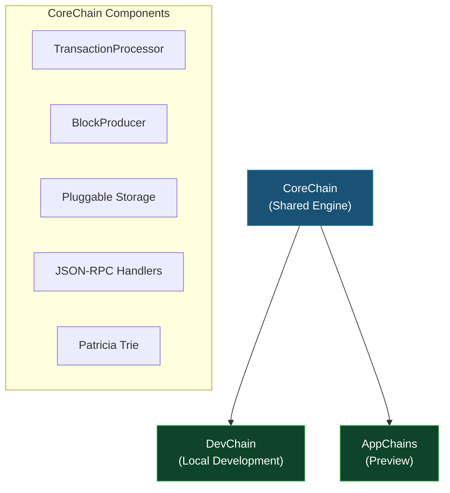

# Chain Infrastructure

CoreChain is the shared blockchain engine that powers both [DevChain](/docs/devchain/overview) and [AppChains](/docs/application-chain/overview). It provides the foundational components for running an Ethereum-compatible execution layer entirely in-process.

## Architecture

## Key Components

- **TransactionProcessor** — validates signatures and nonces, executes EVM bytecode, produces receipts
- **BlockProducer** — assembles pending transactions into blocks, calculates state roots via Patricia trie
- **Pluggable Storage** — in-memory (testing), SQLite (DevChain), or RocksDB (production) via `IBlockStore`, `ITransactionStore`, `IStateStore`, `ILogStore`, `ITrieNodeStore`
- **JSON-RPC Handlers** — built-in handlers for all standard `eth_*`, `net_*`, `web3_*`, and `debug_trace*` methods
- **Merkle Proof Generation** — `eth_getProof` for state verification
- **Forking** — fork state from live Ethereum networks via `ForkingNodeDataService`

## Packages

| Package | Description |
|---|---|
| `Nethereum.CoreChain` | Core blockchain engine with EVM, block production, and RPC |
| `Nethereum.CoreChain.RocksDB` | RocksDB persistent storage backend for production use |
| `Nethereum.Merkle.Patricia` | Patricia Merkle Trie for state roots and proofs |

## Built On By

- **[DevChain](/docs/devchain/overview)** — adds instant mining, SQLite storage, Hardhat/Anvil compatibility methods, and Aspire templates
- **[AppChains (Preview)](/docs/application-chain/overview)** — adds genesis building, sequencer, P2P networking, and L1 anchoring

## Guides

| Guide | What You'll Learn |
|---|---|
| [Custom Chain Node](guide-custom-chain-node) | Build a local chain node using CoreChain's block production, transaction processing, and storage |
| [Custom Storage](guide-custom-storage) | Implement your own storage backend or use RocksDB for persistent data |
| [Custom RPC Handlers](guide-custom-rpc-handlers) | Add custom JSON-RPC methods to your chain using the extensible handler framework |
| [Forking](guide-forking) | Fork state from live Ethereum networks for local testing and simulation |
