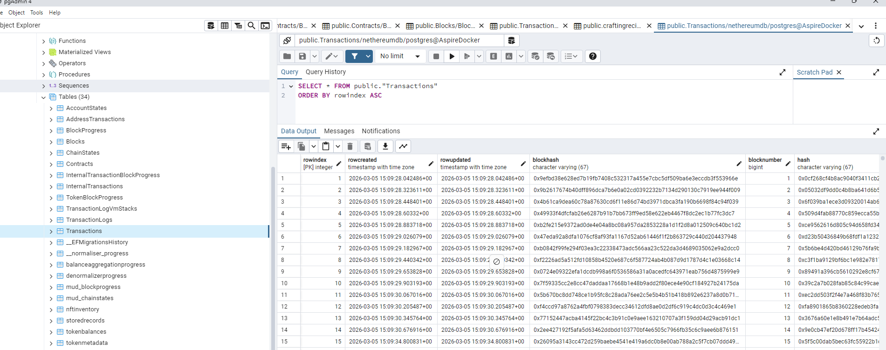

# Database Storage

Once you have a [processing pipeline](./guide-blockchain-processing) crawling blocks, transactions, and logs, the next step is persisting that data. Nethereum provides EF Core-based storage for PostgreSQL, SQL Server, or SQLite. You can use the low-level repository layer to store data from custom processing pipelines, or use the pre-built hosted services that wire everything together as `BackgroundService` instances.

## Packages

| Package | Purpose |
|---------|---------|
| `Nethereum.BlockchainStore.EFCore` | Base DbContext, entity models, repository interfaces |
| `Nethereum.BlockchainStore.Postgres` | PostgreSQL provider |
| `Nethereum.BlockchainStore.SqlServer` | SQL Server provider |
| `Nethereum.BlockchainStore.Sqlite` | SQLite provider |
| `Nethereum.BlockchainStorage.Processors` | Hosted services (database-agnostic) |
| `Nethereum.BlockchainStorage.Processors.Postgres` | PostgreSQL hosted service registration |
| `Nethereum.BlockchainStorage.Processors.SqlServer` | SQL Server hosted service registration |
| `Nethereum.BlockchainStorage.Processors.Sqlite` | SQLite hosted service registration |

---

## Quick Start — Hosted Services

The simplest way to index blockchain data is with the hosted service packages. They run as `BackgroundService` instances, automatically handling progress tracking, retry with exponential backoff, and reorg detection.

### PostgreSQL

```bash
dotnet add package Nethereum.BlockchainStorage.Processors.Postgres
```

```csharp
var builder = Host.CreateApplicationBuilder(args);

builder.Services.AddPostgresBlockchainProcessor(
    builder.Configuration,
    connectionString: "Host=localhost;Database=blockchain;Username=postgres;Password=secret"
);

// Optional: index internal transactions (requires debug_traceTransaction RPC)
builder.Services.AddPostgresInternalTransactionProcessor();

var host = builder.Build();
await host.RunAsync();
```



### SQL Server

```bash
dotnet add package Nethereum.BlockchainStorage.Processors.SqlServer
```

```csharp
builder.Services.AddSqlServerBlockchainProcessor(
    builder.Configuration,
    connectionString: "Server=localhost;Database=blockchain;Trusted_Connection=true"
);
builder.Services.AddSqlServerInternalTransactionProcessor();
```

### SQLite

```bash
dotnet add package Nethereum.BlockchainStorage.Processors.Sqlite
```

```csharp
builder.Services.AddSqliteBlockchainProcessor(
    builder.Configuration,
    connectionString: "Data Source=blockchain.db"
);
builder.Services.AddSqliteInternalTransactionProcessor();
```

### Configuration

All hosted services read from `BlockchainProcessing` in `appsettings.json`:

```json
{
  "BlockchainProcessing": {
    "BlockchainUrl": "http://localhost:8545",
    "Name": "My Chain",
    "MinimumBlockConfirmations": 12,
    "FromBlock": null,
    "ToBlock": null,
    "ReorgBuffer": 12,
    "UseBatchReceipts": true,
    "NumberOfBlocksToProcessPerRequest": 1000,
    "RetryWeight": 50,
    "ProcessBlockTransactionsInParallel": true,
    "PostVm": false
  }
}
```

| Property | Default | Description |
|----------|---------|-------------|
| `BlockchainUrl` | required | JSON-RPC endpoint |
| `MinimumBlockConfirmations` | 12 | Blocks behind chain head before processing |
| `FromBlock` | null | Starting block (if no prior progress) |
| `ToBlock` | null | Stop at this block (null = continuous) |
| `ReorgBuffer` | 0 | Re-check this many recent blocks for reorgs |
| `UseBatchReceipts` | true | Use `eth_getBlockReceipts` for efficiency |
| `NumberOfBlocksToProcessPerRequest` | 1000 | Log batch size |
| `RetryWeight` | 50 | Reduce batch size on failures |
| `ProcessBlockTransactionsInParallel` | true | Parallel transaction processing |
| `PostVm` | false | Include VM stack traces |

Connection string resolution (PostgreSQL): explicit parameter > `ConnectionStrings:PostgresConnection` > `ConnectionStrings:BlockchainDbStorage`.

---

## What Gets Stored

The hosted services persist all blockchain data into these tables:

| Table | Contents |
|-------|----------|
| `blocks` | Block headers — number, hash, parent hash, gas, timestamp, miner |
| `transactions` | Transactions — hash, from, to, value, gas, type, EIP-1559/4844 fields |
| `transactionlogs` | Event logs — address, topics (indexed values), data |
| `contracts` | Deployed contracts — address, creator, bytecode, ABI |
| `internaltransactions` | Call traces — from, to, value, type (CALL/DELEGATECALL/CREATE), depth |
| `addresstransactions` | Address-to-transaction index for fast account lookups |
| `blockprogress` | Last processed block number |
| `chainstates` | Chain ID, last canonical block hash (for reorg detection) |

All records include an `IsCanonical` flag for reorg handling. Non-canonical records are marked but not deleted, so you can query historical forks if needed.

---

## Low-Level Repository API

If you need custom processing logic instead of the hosted services, use the repository factory directly:

```csharp
builder.Services.AddPostgresBlockchainStorage(connectionString);
// This registers IBlockchainStoreRepositoryFactory and all individual repositories
```

Then inject and use repositories:

```csharp
public class MyProcessor
{
    private readonly IBlockRepository _blockRepo;
    private readonly ITransactionRepository _txRepo;
    private readonly ITransactionLogRepository _logRepo;
    private readonly IBlockProgressRepository _progressRepo;

    public MyProcessor(
        IBlockRepository blockRepo,
        ITransactionRepository txRepo,
        ITransactionLogRepository logRepo,
        IBlockProgressRepository progressRepo)
    {
        _blockRepo = blockRepo;
        _txRepo = txRepo;
        _logRepo = logRepo;
        _progressRepo = progressRepo;
    }

    public async Task ProcessBlockAsync(BlockWithTransactions block)
    {
        await _blockRepo.UpsertBlockAsync(block.MapToStorageEntity());
        foreach (var tx in block.Transactions)
            await _txRepo.UpsertAsync(tx.MapToStorageEntity());
        await _progressRepo.UpsertProgressAsync(block.Number.Value);
    }
}
```

### Repository Interfaces

| Interface | Key Methods |
|-----------|------------|
| `IBlockRepository` | `UpsertBlockAsync`, `FindByBlockNumberAsync`, `GetMaxBlockNumberAsync`, `MarkNonCanonicalAsync` |
| `ITransactionRepository` | `UpsertAsync`, `FindByHashAsync`, `MarkNonCanonicalAsync` |
| `ITransactionLogRepository` | `UpsertAsync`, `FindByTransactionHashAndIndexAsync`, `MarkNonCanonicalAsync` |
| `IContractRepository` | `UpsertAsync`, `FindByAddressAsync` |
| `IInternalTransactionRepository` | `UpsertAsync`, `FindByTransactionHashAsync` |
| `IBlockProgressRepository` | `UpsertProgressAsync`, `GetLastBlockNumberProcessedAsync` |
| `IChainStateRepository` | `UpsertAsync`, `GetAsync` |
| `IReorgHandler` | `HandleReorgAsync(fromBlock)` |

### Wire with BlockchainProcessing

Connect the repository factory to the block processing pipeline:

```csharp
var web3 = new Web3("http://localhost:8545");
var repoFactory = serviceProvider.GetRequiredService<IBlockchainStoreRepositoryFactory>();

var processor = web3.Processing.Blocks.CreateBlockStorageProcessor(
    repositoryFactory: repoFactory,
    minimumBlockConfirmations: 12,
    configureSteps: steps =>
    {
        // Add custom handlers alongside the built-in storage handlers
        steps.BlockStep.AddSynchronousProcessorHandler(block =>
            Console.WriteLine($"Stored block {block.Number}"));
    }
);

await processor.ExecuteAsync(cancellationToken: cts.Token);
```

---

## Internal Transaction Indexing

Internal transactions (call traces) are indexed by a separate hosted service that runs behind the main block processor:

```csharp
// Requires debug_traceTransaction RPC support
builder.Services.AddPostgresInternalTransactionProcessor();
```

The service uses the `callTracer` to extract the full call tree for each transaction, storing:
- Call type (CALL, DELEGATECALL, STATICCALL, CREATE, CREATE2)
- From/to addresses, value, gas
- Input/output data
- Error and revert reason
- Trace depth and index

---

## Schema Details

### Entity Column Types

| Column Pattern | Max Length | Example Fields |
|---------------|-----------|---------------|
| Hash | 67 chars | `hash`, `parenthash`, `transactionhash` |
| Address | 43 chars | `addressfrom`, `addressto`, `miner` |
| BigInteger | 100 chars | `value`, `gasused`, `gaslimit` |
| Unlimited text | `text` (Postgres) / `nvarchar(max)` (SQL Server) | `input`, `data`, `abi`, `code` |

### Key Indexes

| Entity | Unique Index | Additional Indexes |
|--------|-------------|-------------------|
| Block | (BlockNumber, Hash) | BlockNumber, Hash, ParentHash, (IsCanonical, BlockNumber) |
| Transaction | (BlockNumber, Hash) | Hash, AddressFrom, AddressTo, NewContractAddress |
| TransactionLog | (TransactionHash, LogIndex) | BlockNumber, Address, EventHash |
| InternalTransaction | (TransactionHash, Index) | BlockNumber |
| Contract | Address | -- |

---

## Next Steps

- [Token Indexing](./guide-token-indexing) — Index ERC-20/721/1155 transfers and aggregate balances on top of the stored data
- [Explorer](./guide-explorer) — Embed a blockchain explorer UI over your indexed data
- [Blockchain Processing](./guide-blockchain-processing) — Review the processing pipeline and handler patterns
