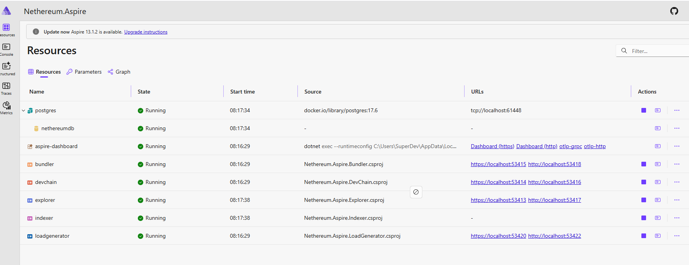

# DevChain Quick Start

:::tip The Simple Way
```csharp
var account = new Account("0xb5b1870957d373ef0eeffecc6e4812c0fd08f554b37b233526acc331bf1544f7");
var devChain = new DevChainNode();
await devChain.StartAsync(account);
var web3 = devChain.CreateWeb3(account);
```
That's it. A full Ethereum node running in your process — no Docker, no binaries, no setup.
:::

Nethereum DevChain is a complete in-process Ethereum node. It runs the full EVM (up to Prague hardfork), mines blocks instantly, and gives you funded accounts out of the box. This guide gets you from zero to a working local chain in under a minute.

## Prerequisites

```bash
dotnet add package Nethereum.DevChain
```

You also need `Nethereum.Web3` for the `Account` class and `Web3` interactions (it's a transitive dependency of `Nethereum.DevChain`).

## Create and Start a Node

The basic workflow is: create a node, start it with funded accounts, then create a `Web3` instance connected to it.

```csharp
using Nethereum.DevChain;
using Nethereum.Web3;
using Nethereum.Web3.Accounts;

// Create an account from a private key
var account = new Account("0xb5b1870957d373ef0eeffecc6e4812c0fd08f554b37b233526acc331bf1544f7");

// Create and start the dev chain — account gets 10,000 ETH
var devChain = new DevChainNode();
await devChain.StartAsync(account);

// Create a Web3 instance wired directly to the in-process node (no HTTP)
var web3 = devChain.CreateWeb3(account);
```

The `CreateWeb3` extension method creates a `Web3` instance that talks to the node via an in-process RPC dispatcher — no network overhead, no port conflicts.

## Send Your First Transaction

With `web3` connected, use all the standard Nethereum APIs as if you were talking to mainnet:

```csharp
// Check balance
var balance = await web3.Eth.GetBalance.SendRequestAsync(account.Address);
Console.WriteLine($"Balance: {Web3.Convert.FromWei(balance.Value)} ETH");

// Transfer ETH
var receipt = await web3.Eth.GetEtherTransferService()
    .TransferEtherAndWaitForReceiptAsync("0xde0b295669a9fd93d5f28d9ec85e40f4cb697bae", 1.0m);

Console.WriteLine($"TX Hash: {receipt.TransactionHash}");
Console.WriteLine($"Block:   {receipt.BlockNumber}");
```

Since `AutoMine` is enabled by default, transactions are mined instantly — `TransferEtherAndWaitForReceiptAsync` returns immediately.

## Configuration

`DevChainConfig` controls chain behavior. The defaults work for most cases, but you can customise:

```csharp
var config = new DevChainConfig
{
    ChainId = 1337,             // Default: 1337
    BlockGasLimit = 30_000_000, // Default: 30M
    AutoMine = true,            // Default: true (mine on each tx)
    InitialBalance = BigInteger.Parse("10000000000000000000000")  // Default: 10,000 ETH
};

var devChain = new DevChainNode(config);
await devChain.StartAsync(account);
```

For Hardhat or Anvil compatibility (ChainId 31337, same mnemonic), use the presets:

```csharp
var devChain = new DevChainNode(DevChainConfig.Hardhat);
var devChain = new DevChainNode(DevChainConfig.Anvil);
```

## Multiple Accounts

Generate and fund multiple accounts automatically:

```csharp
var devChain = new DevChainNode();
await devChain.StartAsync();

// Generate 5 accounts, each funded with the default 10,000 ETH
var accounts = await devChain.GenerateAndFundAccountsAsync(5);

var aliceWeb3 = devChain.CreateWeb3(accounts[0]);
var bobWeb3 = devChain.CreateWeb3(accounts[1]);
```

Or pass specific accounts at startup:

```csharp
var alice = new Account("0xac0974bec39a17e36ba4a6b4d238ff944bacb478cbed5efcae784d7bf4f2ff80");
var bob = new Account("0x59c6995e998f97a5a0044966f0945389dc9e86dae88c7a8412f4603b6b78690d");

await devChain.StartAsync(alice, bob);
```

## Factory Methods

For quick one-liners, use the static factory methods:

```csharp
// Create, configure, and start in one call
var devChain = await DevChainNode.CreateAndStartAsync(account);
var web3 = devChain.CreateWeb3(account);
```

## Storage Options

By default, DevChain uses SQLite for blocks/transactions/receipts/logs and in-memory storage for account state. The SQLite database is deleted automatically when the node is disposed.

**Fully in-memory** (fastest, no disk I/O):

```csharp
var devChain = DevChainNode.CreateInMemory();
await devChain.StartAsync(account);
```

**Persistent storage** (data survives restarts):

```csharp
var devChain = new DevChainNode(DevChainConfig.Default, "./mychain/chain.db", persistDb: true);
await devChain.StartAsync(account);
```

## Cleanup

DevChainNode implements `IDisposable`. Call `Dispose()` when you're done — it cleans up SQLite files and releases resources:

```csharp
devChain.Dispose();
```

Or use `using` for automatic cleanup:

```csharp
using var devChain = new DevChainNode();
await devChain.StartAsync(account);
// ... use the chain ...
// Automatically disposed at end of scope
```



## Next Steps

- [HTTP Server](guide-http-server) — expose DevChain as an HTTP endpoint for MetaMask, Foundry, or any Ethereum tool
- [Testing Patterns](guide-testing-patterns) — use snapshots, time manipulation, and test fixtures for isolated integration tests
- [Forking & State Manipulation](guide-forking-and-state) — fork mainnet and manipulate account state
- For the full API surface, see the [Nethereum.DevChain package reference](nethereum-devchain)
