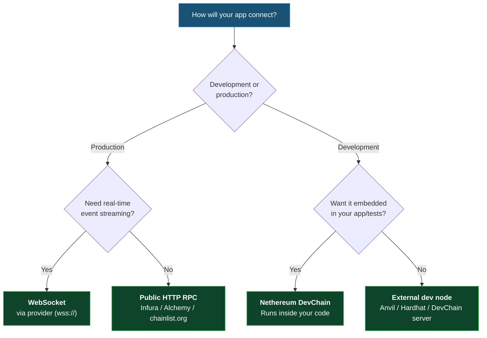

# Choosing How to Connect

Every Nethereum application starts by creating a `Web3` instance with a connection to an Ethereum node. This page compares your options and helps you pick the right one.

## Connection Options at a Glance

| Method | Package | Best For | Subscriptions |
|---|---|---|---|
| **Public RPC (HTTP)** | `Nethereum.Web3` | Production apps, read-heavy workloads | No |
| **Embedded DevChain** | `Nethereum.DevChain` | Tests, local dev — runs inside your app, no setup | No (poll instead) |
| **External dev node** | `Nethereum.Web3` | Anvil, Hardhat, or Nethereum DevChain running separately | Depends on node |
| **WebSocket** | `Nethereum.JsonRpc.WebSocketClient` | Real-time events, streaming | Yes |

## Public RPC

The most common production setup. Point `Web3` at any HTTP JSON-RPC endpoint — a hosted provider or your own node.

```csharp
using Nethereum.Web3;

var web3 = new Web3("https://mainnet.infura.io/v3/YOUR_PROJECT_ID");
```

Nethereum works with any EVM-compatible JSON-RPC endpoint. Just pass the URL.

### Finding an RPC Endpoint

- **[chainlist.org](https://chainlist.org/)** — directory of public RPC endpoints for every EVM chain (Ethereum, Polygon, Arbitrum, Base, etc.)
- **[Infura](https://infura.io/)** — managed Ethereum API (free tier available)
- **[Alchemy](https://www.alchemy.com/)** — managed Ethereum API with enhanced features
- **[Chainlink](https://chain.link/)** — decentralised oracle and node infrastructure

For testnets (Sepolia, Holesky), these providers offer free endpoints — check their dashboards.

**When to use**: Production apps, multi-chain support, when you don't want to run your own node.

**Signing transactions**: Public endpoints don't hold your keys. Use an `Account` to sign locally:

```csharp
using Nethereum.Web3;
using Nethereum.Web3.Accounts;

var account = new Account("0xYOUR_PRIVATE_KEY");
var web3 = new Web3(account, "https://mainnet.infura.io/v3/YOUR_PROJECT_ID");

var receipt = await web3.Eth.GetEtherTransferService()
    .TransferEtherAndWaitForReceiptAsync("0xRecipient", 0.01m);
```

## Embedded DevChain

Nethereum includes its own Ethereum node that runs directly inside your application or test project. No Docker, no external processes, no setup — just add the NuGet package and start it.

```csharp
using Nethereum.DevChain;
using Nethereum.Web3;
using Nethereum.Web3.Accounts;

// Create an account and start the in-process chain
var account = new Account("0xb5b1870957d373ef0eeffecc6e4812c0fd08f554b37b233526acc331bf1544f7");
var devChain = new DevChainNode();
await devChain.StartAsync(account);

// Connect using the in-process client
var web3 = devChain.CreateWeb3(account);

// Account is pre-funded with ETH
var balance = await web3.Eth.GetBalance.SendRequestAsync(account.Address);
Console.WriteLine($"Dev account balance: {Web3.Convert.FromWei(balance.Value)} ETH");
```

**When to use**: Unit tests, integration tests, CI pipelines, local development — anywhere you want a disposable chain that starts and stops with your code.

See the [DevChain section](/docs/devchain/overview) for cluster mode, Aspire integration, and advanced configuration.

## External Dev Nodes

If you prefer to run a separate dev node, just point `Web3` at its URL. Nethereum talks standard JSON-RPC, so it works with any node.

```csharp
using Nethereum.Web3;

// Connect to any local dev node on its default port
var web3 = new Web3("http://127.0.0.1:8545");
```

Popular options:

- **[Anvil](https://book.getfoundry.sh/reference/anvil/)** (Foundry) — fast local chain, widely used in the Solidity ecosystem
- **[Hardhat Network](https://hardhat.org/hardhat-network/docs/overview)** — built into the Hardhat development environment
- **Nethereum DevChain** — run as a [standalone server](/docs/devchain/overview) outside your app

**When to use**: You have an existing Foundry or Hardhat workflow, you want the node running in a separate process, or you need node-specific features.

## WebSocket

Persistent connection that supports real-time event streaming via `eth_subscribe`.

```csharp
using Nethereum.JsonRpc.WebSocketStreamingClient;
using Nethereum.RPC.Reactive.Eth.Subscriptions;
using Nethereum.Web3;

// Basic Web3 connection over WebSocket
var web3 = new Web3("wss://mainnet.infura.io/ws/v3/YOUR_PROJECT_ID");

// Streaming subscriptions for real-time events
using var wsClient = new StreamingWebSocketClient("wss://mainnet.infura.io/ws/v3/YOUR_PROJECT_ID");
await wsClient.StartAsync();

var subscription = new EthNewBlockHeadersObservableSubscription(wsClient);
subscription.GetSubscriptionDataResponsesAsObservable().Subscribe(block =>
{
    Console.WriteLine($"New block: {block.BlockHash} (#{block.Number.Value})");
});
await subscription.SubscribeAsync();
```

**When to use**: Real-time dashboards, event monitoring, applications that need instant notifications.

**Install**: `dotnet add package Nethereum.RPC.Reactive`

## Decision Flowchart



:::tip Other transports
For advanced scenarios, Nethereum also supports **IPC** connections (Unix socket / Windows named pipe via `Nethereum.JsonRpc.IpcClient`) for maximum throughput when co-located with a node, and a **System.Text.Json** serializer (`Nethereum.JsonRpc.SystemTextJsonRpcClient`) for AOT compilation. See [Core Foundation](/docs/core-foundation/overview) for details.
:::

## Next Steps

- [Installation](/docs/getting-started/installation) — set up your project
- [Signing & Key Management](/docs/signing-and-key-management/overview) — manage private keys safely
- [DevChain](/docs/devchain/overview) — run a local Ethereum node embedded in your app
- [Architecture Map](/docs/architecture) — see how all packages fit together
