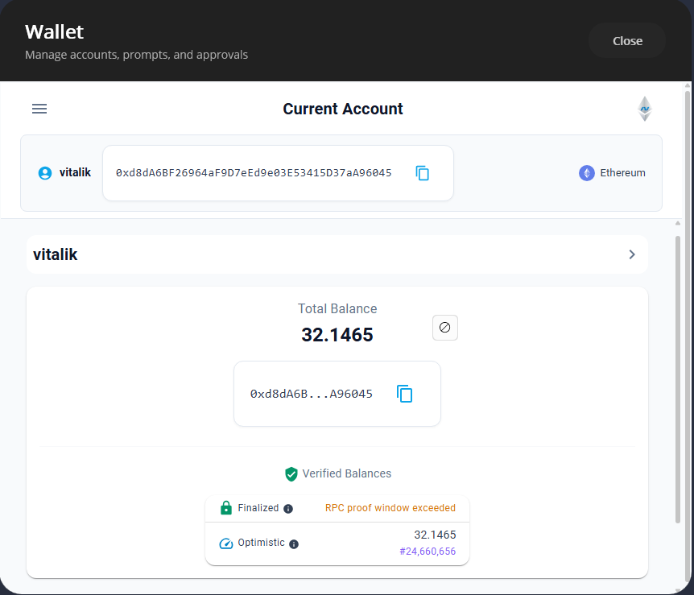

# Wallet Quickstart

This guide walks through standing up a minimal Blazor wallet that creates a vault, generates a mnemonic account, and lists accounts -- all inside a browser.

## Install Packages

```bash
dotnet add package Nethereum.Wallet
dotnet add package Nethereum.Wallet.UI.Components.Blazor
```

## Register Services

In `Program.cs`, register the core wallet services and the Blazor UI layer:

```csharp
using Nethereum.Wallet;
using Nethereum.Wallet.Hosting;
using Nethereum.Wallet.UI.Components.Blazor.Extensions;

var builder = WebAssemblyHostBuilder.CreateDefault(args);

builder.Services.AddSingleton<IEncryptionStrategy, BouncyCastleAes256EncryptionStrategy>();
builder.Services.AddSingleton<IWalletVaultService, LocalStorageWalletVaultService>();
builder.Services.AddSingleton<IWalletConfigurationService, InMemoryWalletConfigurationService>();
builder.Services.AddSingleton<Nethereum.Wallet.Storage.IWalletStorageService, LocalStorageWalletStorageService>();
builder.Services.AddSingleton<IRpcEndpointService, RpcEndpointService>();
builder.Services.AddScoped<IRpcClientFactory, RpcClientFactory>();

builder.Services.AddNethereumWalletHostProvider();
builder.Services.AddNethereumWalletUI();

var app = builder.Build();
app.Services.InitializeAccountTypes();
await app.RunAsync();
```

## Create a Vault and Account (Code-Only)

You can work directly with the vault service without the UI components:

```csharp
@inject IWalletVaultService VaultService
@inject ICoreWalletAccountService AccountService

@code {
    private async Task InitializeWallet()
    {
        await VaultService.CreateNewAsync("my-strong-password");

        var vault = VaultService.GetCurrentVault();
        var account = await AccountService.CreateMnemonicAccountAsync(
            Bip39.GenerateMnemonic(12), label: "Primary");

        vault.AddAccount(account, setAsSelected: true);
        await VaultService.SaveAsync();
    }
}
```

## List Accounts

```csharp
@inject IWalletVaultService VaultService

<ul>
    @foreach (var account in _accounts)
    {
        <li>@account.Name &mdash; @account.Address</li>
    }
</ul>

@code {
    private IReadOnlyList<IWalletAccount> _accounts = Array.Empty<IWalletAccount>();

    protected override async Task OnInitializedAsync()
    {
        _accounts = await VaultService.GetAccountsAsync();
    }
}
```

## Use the Built-In Wallet Shell

For a full wallet experience with account creation, network selection, and transaction screens, drop the `NethereumWallet` component into your layout:

```razor
@using Nethereum.Wallet.UI.Components.Blazor.NethereumWallet

<NethereumWallet />
```

This renders the complete wallet dashboard including account list, token balances, and send transaction flows. Customise the dashboard plugins and configuration via `AddNethereumWalletUIConfiguration`.



## Next Steps

- [Architecture](guide-wallet-architecture) -- understand the 3-layer MVVM model
- [Accounts and Vault](guide-wallet-accounts) -- account types, derivation paths, vault encryption
- [Transactions](guide-wallet-transactions) -- building and sending transactions
