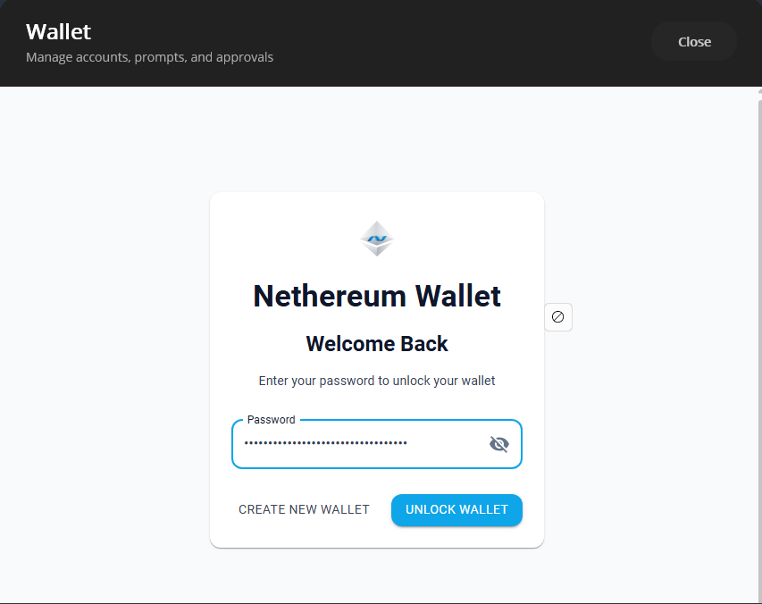

# Wallet SDK

Build multi-platform self-custodial wallet applications using Nethereum's layered MVVM architecture. The Wallet SDK provides core wallet services, shared ViewModels, and platform-specific renderers for Blazor and MAUI.

## Architecture

```
Nethereum.Wallet                              Core services: accounts, vaults, BIP32/BIP39,
                                              chain config, transaction building, EVM preview
    + Nethereum.Wallet.UI.Components          Platform-agnostic MVVM ViewModels
                                              (CommunityToolkit.Mvvm, localisation EN/ES)
    + Nethereum.Wallet.UI.Components.Blazor   Blazor/MudBlazor renderer
      or .Maui                                .NET MAUI renderer
```

## What's in the Box

| Layer | Packages | Purpose |
|---|---|---|
| **Core** | `Nethereum.Wallet`, `Nethereum.UI` | Account management, vault encryption, chain configuration, transaction building, EVM state preview, SIWE authenticator |
| **ViewModels** | `Nethereum.Wallet.UI.Components`, `.Trezor` | Cross-platform MVVM ViewModels for every wallet screen with field-level validation and localisation |
| **Renderers** | `.Blazor`, `.Blazor.Trezor`, `.Maui` | Platform-specific UI implementations |
| **RPC** | `Nethereum.Wallet.RpcRequests` | EIP-1193 JSON-RPC request handlers for wallet-to-dApp communication |
| **Hardware** | `Nethereum.Maui.AndroidUsb` | Android USB transport for Ledger/Trezor on MAUI |



## Account Types

The wallet supports multiple account types:

- **Mnemonic** — BIP39 seed phrase with BIP44 derivation paths
- **Private Key** — Direct ECDSA key import
- **Keystore** — Web3 Secret Storage encrypted files
- **View-Only** — Address monitoring without signing capability
- **Hardware** — Ledger and Trezor via USB (desktop/Android)

## Getting Started

Install the core + your renderer:

```bash
dotnet add package Nethereum.Wallet
dotnet add package Nethereum.Wallet.UI.Components.Blazor
```

Register services in DI:

```csharp
builder.Services.AddNethereumWallet();
builder.Services.AddNethereumWalletBlazorComponents();
```

## Packages

| Package | Description |
|---|---|
| [`Nethereum.UI`](../wallet-connectivity/nethereum-ui) | Abstract `IEthereumHostProvider`, SIWE authenticator, validation helpers |
| [`Nethereum.Wallet`](nethereum-wallet) | Core wallet: accounts, vaults, chain config, HD wallets, dApp management |
| [`Nethereum.Wallet.RpcRequests`](nethereum-wallet-rpcrequests) | EIP-1193 JSON-RPC handlers |
| [`Nethereum.Wallet.UI.Components`](nethereum-wallet-ui-components) | Cross-platform MVVM ViewModels |
| [`Nethereum.Wallet.UI.Components.Trezor`](nethereum-wallet-ui-components-trezor) | Trezor hardware wallet ViewModels |
| [`Nethereum.Wallet.UI.Components.Blazor`](nethereum-wallet-ui-components-blazor) | Blazor/MudBlazor renderer |
| [`Nethereum.Wallet.UI.Components.Blazor.Trezor`](nethereum-wallet-ui-components-blazor-trezor) | Blazor Trezor components |
| [`Nethereum.Wallet.UI.Components.Maui`](nethereum-wallet-ui-components-maui) | .NET MAUI renderer |
| [`Nethereum.Maui.AndroidUsb`](nethereum-maui-androidusb) | Android USB transport for hardware wallets |
